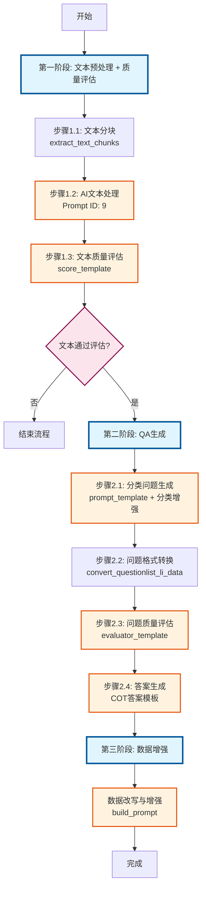
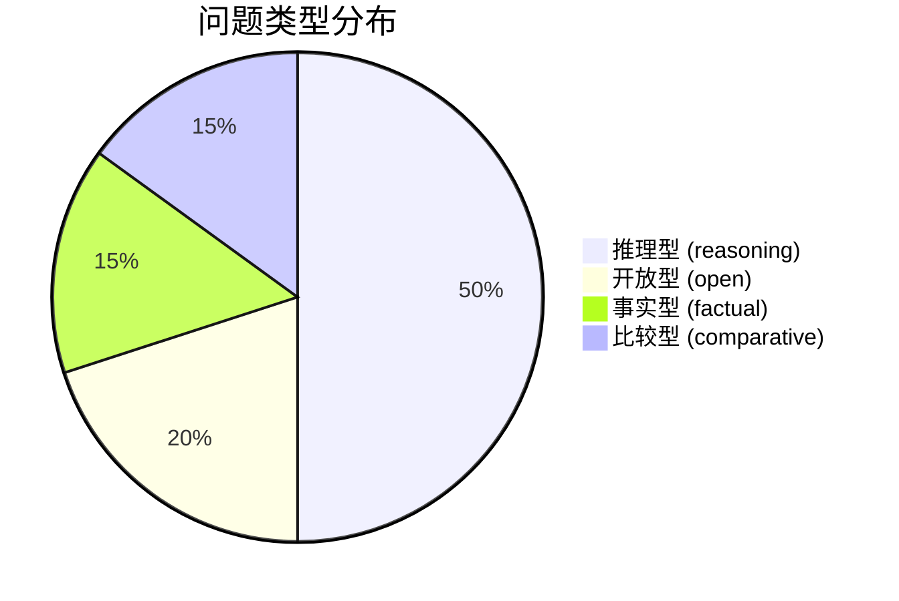

# Prompt调用流程图

## Prompt调用详细说明

### 第一阶段 Prompts

| 步骤 | Prompt名称 | 调用位置 | 主要功能 |
|------|-----------|---------|----------|
| 1.2 | Prompt ID 9 | `input_text_process()` | 处理文本并生成图片相关的QA数据 |
| 1.3 | score_template | `judge_processed_texts()` | 评估文本质量，判断是否适合生成推理问题 |

### 第二阶段 Prompts

| 步骤 | Prompt名称 | 调用位置 | 主要功能 |
|------|-----------|---------|----------|
| 2.1 | prompt_template + 分类增强 | `generate_classified_questions()` | 生成不同类型的问题 |
| 2.3 | evaluator_template | `judge_question_data()` | 评估问题质量 |
| 2.4 | COT答案模板 | `generate_answers()` | 为问题生成详细答案 |

### 第三阶段 Prompts

| 步骤 | Prompt名称 | 调用位置 | 主要功能 |
|------|-----------|---------|----------|
| 3.1 | build_prompt | `enhance_qa_data()` | 改写和增强QA数据 |

### 特殊用途 Prompts

| ID | 用途 | 使用场景 |
|----|------|----------|
| 343 | 多模态图片问题生成 | 处理包含图片的文档 |
| 36 | 推理有效性检查 | 质量控制 |
| 37 | 问题清晰度检查 | 质量控制 |
| 39 | 答案正确性检查 | 质量控制 |
| 40 | 难度适中性检查 | 质量控制 |

## 问题类型分布

